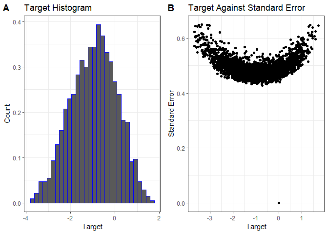

## Abstract

The aim of this project is to predict the 'ease of reading' of an excerpt of text from a book for schoolchildren. In this analysis we consider two approaches to the modelling stage. The first stage, common to all modelling approaches, is to pre-process the excerpt texts using standard techniques such as removing stop words and punctuation and word-stemming. In approach 1) we use a GloVe word-embedding encoder with CNN-LSTM layers to model the readability from the cleaned excerpt text and then modelling the residual with a gradient-boosted model using text-based features (e.g. average word length, average sentence length etc.). In approach 2) we use the Google trained sentence-embedding encoder *Universal Sentence Encoder*. Sentence-embeddings tend to perform better than word-embeddings because the attention layers can retain context through longer sequences of text. 

## Introduction

The data and problem is taken from a Kaggle competition to judge the difficulty of a passage of text with the aim of helping schoolchildren read books at an appropriate reading level. The data is composed of a training dataset and a hidden test dataset, and the two columns of interest are the *target* (ease of readability) and the *excerpt* (passage of text from a book). 

The target, ease of readability, is the result of many teachers evaluating an excerpt of text relative to another excerpt. An aggregation scoring metric, Bradley-Terry analysis, is used to calculate a single readability score for each text - the target. This means that there is a degree of variability in the readability score given to each excerpt - this suggests that one line of analysis is to use a Bayesian approach that incorporates the uncertainty around the repeated measurements, however unfortunately the individual ratings are not provided, only the aggregated score.

The training dataset can be seen in the preview:
<div data-pagedtable="false">
  <script data-pagedtable-source type="application/json">
{"columns":[{"label":[""],"name":["_rn_"],"type":[""],"align":["left"]},{"label":["id"],"name":[1],"type":["chr"],"align":["left"]},{"label":["url_legal"],"name":[2],"type":["chr"],"align":["left"]},{"label":["license"],"name":[3],"type":["chr"],"align":["left"]},{"label":["excerpt"],"name":[4],"type":["chr"],"align":["left"]},{"label":["target"],"name":[5],"type":["dbl"],"align":["right"]},{"label":["standard_error"],"name":[6],"type":["dbl"],"align":["right"]}],"data":[{"1":"c12129c31","2":"","3":"","4":"When the young people returned to the ballroom, it presented a decidedly changed appearance. Instead of an interior scene, it was a winter landscape.\\nThe floor was covered with snow-white canvas, not laid on smoothly, but rumpled over bumps and hillocks, like a real snow field. The numerous palms and evergreens that had decorated the room, were powdered with flour and strewn with tufts of cotton, like snow. Also diamond dust had been lightly sprinkled on them, and glittering crystal icicles hung from the branches.\\nAt each end of the room, on the wall, hung a beautiful bear-skin rug.\\nThese rugs were for prizes, one for the girls and one for the boys. And this was the game.\\nThe girls were gathered at one end of the room and the boys at the other, and one end was called the North Pole, and the other the South Pole. Each player was given a small flag which they were to plant on reaching the Pole.\\nThis would have been an easy matter, but each traveller was obliged to wear snowshoes.","5":"-0.3402591","6":"0.4640090","_rn_":"1"},{"1":"85aa80a4c","2":"","3":"","4":"All through dinner time, Mrs. Fayre was somewhat silent, her eyes resting on Dolly with a wistful, uncertain expression. She wanted to give the child the pleasure she craved, but she had hard work to bring herself to the point of overcoming her own objections.\\nAt last, however, when the meal was nearly over, she smiled at her little daughter, and said, \"All right, Dolly, you may go.\"\\n\"Oh, mother!\" Dolly cried, overwhelmed with sudden delight. \"Really?\\nOh, I am so glad! Are you sure you're willing?\"\\n\"I've persuaded myself to be willing, against my will,\" returned Mrs. Fayre, whimsically. \"I confess I just hate to have you go, but I can't bear to deprive you of the pleasure trip. And, as you say, it would also keep Dotty at home, and so, altogether, I think I shall have to give in.\"\\n\"Oh, you angel mother! You blessed lady! How good you are!\" And Dolly flew around the table and gave her mother a hug that nearly suffocated her.","5":"-0.3153723","6":"0.4808050","_rn_":"2"},{"1":"b69ac6792","2":"","3":"","4":"As Roger had predicted, the snow departed as quickly as it came, and two days after their sleigh ride there was scarcely a vestige of white on the ground. Tennis was again possible and a great game was in progress on the court at Pine Laurel. Patty and Roger were playing against Elise and Sam Blaney, and the pairs were well matched.\\nBut the long-contested victory finally went against Patty, and she laughingly accepted defeat.\\n\"Only because Patty's not quite back on her game yet,\" Roger defended; \"this child has been on the sick list, you know, Sam, and she isn't up to her own mark.\"\\n\"Well, I like that!\" cried Patty; \"suppose you bear half the blame, Roger. You see, Mr. Blaney, he is so absorbed in his own Love Game, he can't play with his old-time skill.\"\\n\"All right, Patsy, let it go at that. And it's so, too. I suddenly remembered something Mona told me to tell you, and it affected my service.\"","5":"-0.5801180","6":"0.4766762","_rn_":"3"}],"options":{"columns":{"min":{},"max":[10]},"rows":{"min":[10],"max":[10]},"pages":{}}}
  </script>
</div>


## Data Analysis

A brief exploratory data analysis is given here. The focus is on the target column and assessing correlations between text features and the target to inform the GBM feature selection process.


```
## Warning: package 'cowplot' was built under R version 3.6.3
```

```
## Warning: package 'ggplot2' was built under R version 3.6.3
```

```
## `stat_bin()` using `bins = 30`. Pick better value with `binwidth`.
```

<!-- -->

The standard error comes from the multiple comparisons that are used to form the aggregated target, ease of readability, score. The benchmark exerpt used as a comparison can be seen as the point at (0,0).

The next step, is to look for correlations between the target score and features that can be derived from the text. 
<div class="figure" style="text-align: center">

<p class="caption">Figure 1: Spearman correlation plot.</p>
</div>
The correlation plot (ref corrplot) shows the correlation between target and a large number of features derived from the cleaned excerpt text. Noteworthy correlations are the ratio of unique words in the text to total word count (positive correlation) and number of infrequent words from the corpus in the text, number of characters and number of sentences (negative correlation). The infrequent word count metric is the total number of words that appear rarely in the combined corpus of all text excerpts, appearing in that excerpt. The positive correlation means that more unique words means more difficult readability score and the negative correlation means fewer characters, sentences and infrequent words means an easier readability score.

## Pre-Processing Steps

**Text Pre-Processing**
The text are excerpts from books aimed at schoolchildren so very little formal cleaning is required, compared to say posts from twitter. However, to achieve better performance from the model fitting we will use lowercase, remove punctuation and remove stop words. This is done using the *NLTK* library.

**Centered Target**
In the target histogram figure we can see that the target values are not centered around zero, and we know that many statistical techniques find optimal solutions more reliably if the dependent variable has mean zero.Therefore we use the mean of the target to centre this variable
$$ \tilde{t}_i = t_i - \bar{t}, \quad \forall i $$
where $t$ is the original target and $\tilde{t}$ is the centered target.

## Baseline Model

The baseline model is a simple approach to predicting the target that serves as a benchmark for the more complicated models. The baseline model is the mean of the target
$$ y_i = \bar{y}, \quad \forall i . $$

## Method 1 : Word Embedding Encoder CNN-LSTM and GBM Residual 

The approach taken is to use a two-step model; first, a word-embedding recurrent neural network is used to predict the target from the excerpt and then a gradient-boosted model (GBM) is fit to the residual of the target and predicted target from stage 1 using features derived from the excerpts. 

**Stage 1 : GloVe Embedding Layer with CNN-LSTM Layers : Tensorflow**

The Global Vectors for Word Representation (GloVe) is a method to create vector representations of words to pass into statistical models, e.g. regression, support vector machines and machine learning such as recurrent neural networks. The GloVe pre-trained model that we use is the 50d version trained on Wikipedia; the 50d refers to the dimension of the vector representation. The excellent part of the vector representation is that vector algebra can be used to calculate distances between "words" in the vector space. 

The recurrent neural network that takes as input the word-embedding encoder layer is composed of several layers that were identified using a cross-validation procedure. The layers are two one-dimensional CNNs, a max pooling layer, a LSTM layer, a dense neural network layer and finally the full neural network layer with one node that outputs the target. 

<div class="figure" style="text-align: center">

<p class="caption">Figure 2: GloVe CNN-LSTM Architecture.</p>
</div>

**Stage 2 : GBM with the Residual**

The second stage of this approach is to take the residual from stage 1 and fit a GBM with features derived from the text alone. 

Denote the predicted targets from the stage 1 model, word-embedding and RNNs, as $\hat{y}^1$ and the actual targets as $y$, then the dependent variable to the GBM is
$$ \tilde{y}_i = y_i - \hat{y}^1_i . $$

The following features are created: infrequent word ratio, unique word ratio, clause count, character count and word count. Infrequent words are words that appear in very few texts and unique words are the dictionary of words that appear in a text. For clause count, character and word count we calculate the minimum, maximum, mean, median and inter-quantile value over the sentences in each text. 

The importance plot from the GBM is given below:

<div class="figure" style="text-align: center">

<p class="caption">Figure 3: Feature Importance Plot.</p>
</div>

## Method 2 : Universal Sentence Encoder (USE) with Full Neural Net 

The Universal Sentence Encoder model addresses a short-coming of the word embedding models, a difficulty retaining long-range dependencies. The sentence-level embedding is trained using a transformer-encoder architecture which have been generally shown to outperform word embeddings, which is attributed to the ability to learn relationships between words that are much farther apart.

In this method the output of the universal sentence encoder is passed into a series of fully-connected neural networks. The architecture is given below.

<div class="figure" style="text-align: center">

<p class="caption">Figure 4: USE NN Architecture</p>
</div>

## Results

The validation results on the test dataset for the baseline (mean of target) model, the GloVe embedding model and the USE model are compared by calculating the RMSE between the target and the predicted values. The RMSE residual, denoted $r$, is defined
$$  r_i =  \forall i  . $$
The results are presented below.

| Method | RMSE |  
|----------------|------------------------|
| Baseline (mean) | 1.084 |
| GloVe CNN-LSTM + GBM | 0.692 | 
| Universal Sentence Encoder | 0.438 |

From the RMSE comparisons we see clearly that both approaches are better than the baseline model, the mean of the targets, and that the sentence-embedding method is out-performing the word-embedding method + GBM approach.

In addition, we plot the residual of the target and predicted targets:
<div class="figure" style="text-align: center">

<p class="caption">Figure 5: Residual against Target</p>
</div>


